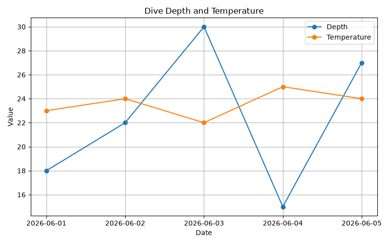

# DiveAnalyzer

DiveAnalyzer is a Python command-line application for analyzing scuba diving log data stored in CSV files. It validates the input data, calculates summary statistics, creates visualizations, and exports a textual dive report.

## Example Output



## Features

- Load dive data from CSV files
- Validate input data before processing
- Generate summary statistics
- Generate a textual dive report
- Visualize depth and temperature over time
- Save plots as PNG files
- Export the report as a text file
- Accept the CSV file path through a command-line interface
- Test the main project components with pytest

## Installation

Clone the repository:

```bash
git clone https://github.com/nicoisenberg/DiveAnalyzer.git
cd DiveAnalyzer
```

Install the required packages:

```bash
python -m pip install -r requirements.txt
```

## Usage

Run DiveAnalyzer and provide the path to a CSV file:

```bash
python main.py data/dive_data.csv
```

Display the command-line help:

```bash
python main.py --help
```

## Input Data

The input file must be a CSV file containing the required dive data columns.

Example:

```csv
Date,Depth,Temperature
2026-06-01,25,22
2026-06-05,30,20
2026-06-10,20,24
```

## Testing

Run all automated tests with:

```bash
python -m pytest
```

## Project Structure

```text
DiveAnalyzer/
├── data/
├── plots/
│   └── dive_plot.png
├── reports/
├── src/
│   ├── loader.py
│   ├── analysis.py
│   ├── plotting.py
│   ├── report.py
│   └── validation.py
├── tests/
│   ├── test_loader.py
│   ├── test_analysis.py
│   ├── test_plotting.py
│   ├── test_report.py
│   └── test_validation.py
├── main.py
├── requirements.txt
├── LICENSE
└── README.md
```

## Technologies Used

- Python
- Pandas
- Matplotlib
- argparse
- pytest
- Git
- GitHub

## Learning Objectives

This project was built to practice:

- Modular Python programming
- Working with CSV files and Pandas DataFrames
- Data analysis with Pandas
- Data visualization with Matplotlib
- Input validation and error handling
- Command-line interfaces with argparse
- Automated testing with pytest
- Version control with Git and GitHub
- Basic software project organization

## Future Improvements

- Support additional dive statistics
- Analyze multiple CSV files
- Generate PDF reports
- Create interactive visualizations
- Improve command-line configuration
- Support additional input formats

## License

This project is licensed under the MIT License. See the [LICENSE](LICENSE) file for details.